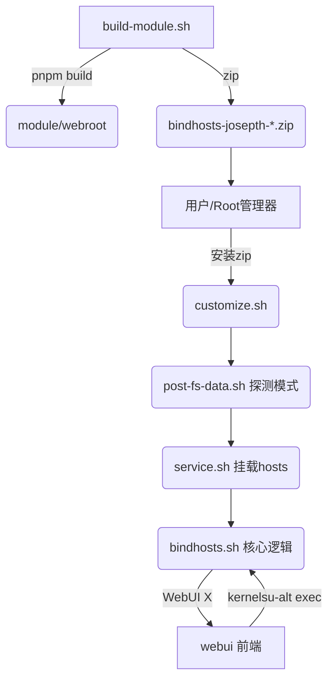

## 用户需求

在 `docs/study/` 目录下生成一套项目学习文档，完整回答 bindhosts（josepth fork）这个项目"是什么、做什么、怎么做"，要求：

- 深入到代码的每一个细节（脚本级、函数级、前端页面级）
- 普通人一眼能看懂，专业名词（Magisk/KernelSU/overlayfs/hosts/root/WebUI X/Vite/CodeMirror 等）都附上网络上有效说明链接
- 不改动任何代码，只新建文档

## 产品概述

bindhosts 是一个 Android root 模块，在已 root 的设备上接管并管理 `/system/etc/hosts` 文件，实现广告/跟踪域名屏蔽与用户自定义 hosts 规则。本文档是面向学习者与二次开发者的"项目解剖书"，覆盖模块侧 shell 脚本与 webui 前端两大部分。

## 核心特性

- 项目总览与背景知识链接（root、Magisk、KernelSU、hosts、overlayfs 等）
- 目录结构与每个文件的职责说明
- 模块侧：customize.sh / post-fs-data.sh / service.sh / action.sh / bindhosts.sh / utils.sh / uninstall.sh 等逐文件函数级解读
- 前端侧：路由、首页/规则页/更多页三页功能与关键函数级解读（含前后端如何通过 kernelsu-alt 通信）
- 构建与发布：build-module.sh、update.json、版本号同步规则
- 日常使用流程（安装、更新、增删规则）

## 技术栈

- 文档格式：Markdown（与项目现有 Documentation/ 一致）
- 语言：简体中文
- 图表：Mermaid（架构图、数据流图，用 ```mermaid 包裹）
- 链接策略：专业名词指向官方文档/Wikipedia/中文资料（如 Magisk GitHub、KernelSU 文档、hosts Wikipedia、overlayfs 内核文档、Vite 官网、CodeMirror 官网、WebUI X 说明）

## 实现方法

采用"分层解剖"式文档结构：先总览与背景知识，再按"模块侧 → 前端侧 → 构建发布 → 使用"四个维度深入代码细节。每份文档聚焦一个主题，避免单文件过长；用 README.md 作为索引串联。所有代码片段标注文件路径与行号区间，关键函数逐段解释"做什么、为什么"。

## 实现要点

- 忠实于已读取的代码：bindhosts.sh 的函数（setup_link/main_commit/action/force_update/whitelist 等）、各生命周期脚本职责、webui 的 route.js/home.js/hosts.js/more.js 交互链路均按实际代码描述。
- 如实标注差异：home.js 依赖 mode.sh，但本 fork 仓库无 mode.sh（搜索 0 文件）、module.prop 也无 mode 字段，文档需说明"模式选择为开发者选项，依赖 mode.sh，当前未提供时走默认模式"；home.js 第24行 `replace('status: ','')` 为兼容性健壮性处理需点明。
- 模块 id 保持 bindhosts 以覆盖原版（铁律1）、zip 名带 -josepth 仅作分发区分（铁律2）需在"构建发布"章节说明。
- 因 GitHub 无 release 权限，发版改用本地 build-module.sh（已提交），文档据此描述发布流程。

## 架构设计



## 目录结构

```
docs/study/
├── README.md              # [NEW] 文档索引与阅读导航，一句话总览项目
├── 01-what-is-bindhosts.md # [NEW] 项目是什么：定位、用途、背景知识链接（root/Magisk/KernelSU/hosts/overlayfs）
├── 02-project-structure.md # [NEW] 目录结构总览，每个文件一句话职责
├── 03-module-scripts.md    # [NEW] 模块侧：customize/post-fs-data/service/action/bindhosts/utils/uninstall 逐文件函数级解读
├── 04-webui-frontend.md    # [NEW] 前端侧：route.js + index.js + home/hosts/more 三页函数级解读与前后端通信
├── 05-build-and-release.md # [NEW] build-module.sh、update.json、版本号同步铁律、本地发版流程
└── 06-usage.md             # [NEW] 安装/更新/增删规则/模式选择 日常使用流程
```

## Agent Extensions

### SubAgent

- **code-explorer**
- Purpose: 在撰写文档前，对 module/ 与 webui/ 下尚未逐行读取的脚本（如 modes.json、utils 工具函数、more.js、common/repo.json）做补充检索，确保函数级描述准确无误、行号正确。
- Expected outcome: 产出各未读文件的关键函数清单与行号映射，供文档撰写引用，避免凭记忆杜撰。