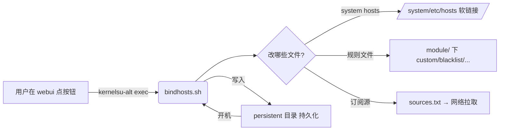

# 02 · 项目结构总览

本章把仓库里**每一个文件**的职责用一句话讲清，让你建立"文件夹地图"。深入细节见 03（模块脚本）和 04（前端）。

> 说明：以下结构基于当前 `master` 分支实际文件。构建产物 `module/webroot/` 由 `webui/` 经 Vite 打包生成，不手写。

---

## 2.1 顶层结构

```
bindhosts/
├── module/              # 【手机端核心】Magisk/KernelSU 模块本体（shell 脚本 + 配置）
├── webui/              # 【网页端】管理界面源码（Vite + 原生 JS）
├── Documentation/       # 原版英文/其他文档（与本项目学习文档无关，本目录 docs/study 另立）
├── docs/study/          # 【本文档】项目学习文档
├── update.json          # 版本与更新信息（OTA 检查读它）
├── build-module.sh      # 本地打包脚本（替代无 release 权限的 GitHub Action）
├── CHANGELOG.md         # 版本更新记录
├── README.md / README_zh-CN.md  # 项目说明（对外）
└── crowdin_*.yml        # 翻译平台配置文件
```

---

## 2.2 `module/` 目录（装在手机里的"大脑"）

| 文件 | 一句话职责 | 详解 |
|------|-----------|------|
| `module.prop` | 模块的"身份证"：id、版本、作者、更新地址 | [03 §3.1](./03-module-scripts.md#31-moduleprop-模块身份证) |
| `bindhosts.sh` | **核心脚本**（430 行）：建立链接、应用 hosts、更新、增删规则 | [03 §3.2](./03-module-scripts.md#32-bindhostssh-核心大脑) |
| `utils.sh` | 公共工具函数（日志、root 方案探测、overlayfs 操作等），被其他脚本 source | [03 §3.3](./03-module-scripts.md#33-utilssh-公共工具箱) |
| `customize.sh` | 安装时执行：探测模式、挂 overlayfs、注册定时更新、建立软链接 | [03 §3.4](./03-module-scripts.md#34-customizesh-安装时初始化) |
| `post-fs-data.sh` | 开机早期执行：决定工作模式（overlay/ksu_webroot 等） | [03 §3.5](./03-module-scripts.md#35-post-fs-datash-开机早期决策) |
| `service.sh` | 开机后服务：提交 webroot 到 overlayfs、拉起后台 | [03 §3.6](./03-module-scripts.md#36-servicesh-开机服务) |
| `boot-completed.sh` | 开机完成广播后执行：最终应用 hosts | [03 §3.7](./03-module-scripts.md#37-boot-completedsh-开机完成收尾) |
| `action.sh` | 用户在管理器里点"操作"按钮时执行（action 参数分发） | [03 §3.8](./03-module-scripts.md#38-actionsh-管理器操作入口) |
| `late-load.sh` | KernelSU 场景：late_load 阶段挂载 webroot | [03 §3.9](./03-module-scripts.md#39-late-loadsh-ksu-挂载) |
| `hotinstall.sh` | 免重启热安装逻辑 | [03 §3.10](./03-module-scripts.md#310-hotinstallsh-热安装) |
| `uninstall.sh` | 卸载模块时清理：移除 hosts 软链接、还原系统文件 | [03 §3.11](./03-module-scripts.md#311-uninstallsh-卸载清理) |
| `sources.txt` | hosts 订阅源列表（默认指向 josepth 自己的屏蔽源） | [03 §3.12](./03-module-scripts.md#312-sourcestxt-订阅源) |
| `common/repo.json` | 仓库元信息（README/截图/支持链接，供 MMRL 等读取） | [03 §3.13](./03-module-scripts.md#313-modulecommonrepojson-仓库元信息) |
| `webroot/` | **构建产物**：`webui/` 打包后的网页，安装到系统供 WebUI 打开 | 由 Vite 生成，见 [04](./04-webui-frontend.md) |
| `action/` `post-fs-data/` 等占位 | Magisk 约定的脚本放置目录（本 fork 逻辑直接放在 module 根） | — |

---

## 2.3 `webui/` 目录（手机里打开的"管理网页"）

| 路径 | 一句话职责 | 详解 |
|------|-----------|------|
| `package.json` | 前端依赖与脚本（dev/build） | [04 §4.1](./04-webui-frontend.md#41-工程配置) |
| `vite.config.js` | Vite 构建配置：入口、输出到 `module/webroot` | [04 §4.2](./04-webui-frontend.md#42-构建配置) |
| `index.js` | **前端入口**：页面加载时初始化、建立软链接、彩蛋、自定义样式 | [04 §4.3](./04-webui-frontend.md#43-入口-indexjs) |
| `route.js` | 单页路由：home/hosts/more 三页注册与切换 | [04 §4.4](./04-webui-frontend.md#44-路由-routejs) |
| `page/home/` | **首页**：状态卡片 + 域名查询 | [04 §4.5](./04-webui-frontend.md#45-首页-home) |
| `page/hosts/` | **规则页**：五类文件编辑 + 运行模块 | [04 §4.6](./04-webui-frontend.md#46-规则页-hosts) |
| `page/more/` | **更多页**：关于/设置/支持 | [04 §4.7](./04-webui-frontend.md#47-更多页-more) |
| `utils/util.js` | 前端工具：MMRL 检测、侧边菜单、滚动事件、模块目录常量 | [04 §4.8](./04-webui-frontend.md#48-前端工具) |
| `utils/language.js` | 多语言翻译加载 | [04 §4.9](./04-webui-frontend.md#49-国际化) |
| `utils/history.js` | 对话框/层的返回栈管理 | [04 §4.10](./04-webui-frontend.md#410-历史栈) |
| `utils/log_catcher.js` | 捕获 WebUI 日志 | [04 §4.11](./04-webui-frontend.md#411-日志捕获) |
| `page/home/modes.json` | 模式列表数据（开发者选项用） | [04 §4.12](./04-webui-frontend.md#412-模式数据) |

---

## 2.4 数据流一图流



> 下一章 [03-module-scripts.md](./03-module-scripts.md) 深入每个脚本的函数级细节。
