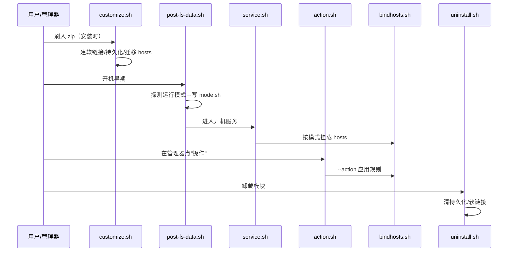

# 03 · 模块侧脚本逐文件解读

本章把 `module/` 目录下**每一个 shell 脚本**拆到「函数级」，配 `文件:行号` 和代码片段。所有行号来自当前 `master` 分支实际代码，末尾有 [§3.14 一致性说明](#314-与代码的一致性)。

> 先记住一条主线：**这些脚本不是一次性全跑，而是手机在不同阶段（安装 / 开机 / 用户点按钮 / 卸载）被系统分别调用。**

---

## 3.0 脚本在什么时机跑？（时序总览）



---

## 3.1 module.prop — 模块身份证

文件：`module/module.prop`（8 行）

```1:8:module/module.prop
id=bindhosts
name=bindhosts
version=v2.1.4
versionCode=214
author=xx, KOWX712
updateJson=https://raw.githubusercontent.com/shiqianwei0508/bindhosts/master/update.json
description=Systemless hosts for APatch, KernelSU and Magisk (josepth fork)
```

| 字段 | 含义 | 注意 |
|------|------|------|
| `id=bindhosts` | 模块唯一 id | **铁律1**：故意保持 bindhosts，用来覆盖原版 |
| `version` / `versionCode` | 版本号 / 整数版本码 | 发版要同步涨（铁律3） |
| `author` | 原作者署名 | **铁律6**：不改写成自己 |
| `updateJson` | OTA 检查地址 | 指向 `master` 分支（铁律4） |
| `description` | 描述 | 安装时显示；**注意**：运行时会被 `service.sh` 动态改写（见 §3.6） |

> 这里 `description` 本身**不含** `status:` 前缀。前端 `home.js` 里有一段 `replace('status: ','')` 的兼容处理，是为了应对被 `service.sh` 改写后的动态描述，详见 [04 §4.5]。

---

## 3.2 bindhosts.sh — 核心大脑（702 行）

文件：`module/bindhosts.sh`。这是整个模块的逻辑核心，处理"应用规则、查询、增删、更新"等所有实际操作。

### 3.2.1 头部：变量与依赖（1–132 行）

```1:6:module/bindhosts.sh
#!/bin/sh
MODDIR="/data/adb/modules/bindhosts"   # 模块目录
PERSISTENT_DIR="/data/adb/bindhosts"   # 持久化目录（重启不丢）
. $MODDIR/utils.sh                     # 引入公共函数
. $MODDIR/mode.sh                      # 引入运行模式（由 post-fs-data.sh 生成）
```

- 第 6 行 `. $MODDIR/mode.sh`：`mode.sh` **不是仓库文件**，而是 `post-fs-data.sh` 第 114 行运行时生成的（见 §3.5）。它提供变量 `operating_mode`（数字 0–10，决定用哪种方式挂载 hosts）。
- 第 7–132 行定义大量路径变量：`WEBROOT`、`TMP_DIR`、`HOSTS_FILE`、`CUSTOM_FILE`、`BLACKLIST_FILE`、`WHITELIST_FILE`、`SOURCES_FILE`、`SOURCES_WHITELIST_FILE` 等，以及 `arch`/`ABI` 探测、`busybox` 路径。

### 3.2.2 完整函数清单（按实际定义行号）

| 函数 | 行号 | 作用 |
|------|------|------|
| `adaway_warn` | 41 | 检测到已装 AdAway 时警告冲突 |
| `illusion` | 76 | 彩蛋（无害障眼法） |
| `run_crond` | 80 | 拉起 `busybox crond` 跑定时任务 |
| `_month_txt2dec` / `_day_txt2dec` | 88 / 107 | cron 月份/日期文字→数字 |
| `_is_valid_cron_arg` | 121 | 校验 cron 参数合法性 |
| `custom_cron` | 233 | 自定义 cron 表达式 |
| `enable_cron` | 278 | 写定时任务（每日更新） |
| `disable_cron` | 287 | 删定时任务 |
| `toggle_updatejson` | 305 | 切换 module.prop 的 updateJson |
| `adblock` | 328 | **核心**：合并规则生成 hosts |
| `reset` | 399 | 清用户规则后重建 |
| `run` | 412 | 参数分发/拉源应用 |
| `quick_reset_restore` | 442 | 快速重置还原 |
| `action` | 476 | 被 action.sh 调用的应用封装 |
| `tcpdump` | 527 | 抓 DNS 包 |
| `stop_tcpdump` | 543 | 停抓包 |
| `hosts_lastmod` | 550 | hosts 最后修改时间 |
| `hosts_query` | 554 | 查某域名 |
| `instant_whitelist` | 565 | 即时加白名单 |
| `setup_link` | 575 | 建 hosts 软链接/挂载 |
| `manager_install_zip` | 584 | 管理器内直接安装 zip |
| `update_locales` | 616 | 拉最新多语言 |
| `install_latest_artifact` | 628 | 自更新（= `--install-canary`） |
| `show_help` | 666 | 打印帮助 |

> 注意：脚本里**没有** `download`、`main_commit`、`check_perm`、`force_update`、`blacklist`、`nightly`、`pause`、`resume` 这些函数（旧版/记忆遗留名），实际参数名见 §3.2.14。

### 3.2.3 adblock — 应用 hosts 规则（核心，328 行）

函数 `adblock` 是"把规则真正写进系统 hosts"的主流程。伪代码逻辑：

1. 清空/重建 `HOSTS_FILE`（模块目录里的 hosts）；
2. 依次合并：`sources.txt`（订阅源拉取的屏蔽列表）→ `custom.txt`（用户自定义）→ `blacklist.txt`（强制屏蔽）→ `sources_whitelist.txt`/`whitelist.txt`（白名单，从前面结果里剔除）；
3. 写入头注释 `# bindhosts vX` 标记"已生效"；
4. 通过 `setup_link` 把模块 hosts 软链接/挂载到 `/system/etc/hosts`。

> 关键细节：白名单（`--whitelist` 加的域名）会在生成最终 hosts 时**从屏蔽结果中剔除**，实现"这个广告域名放过"。

### 3.2.3 run / action — 入口与"应用"

- `run`（约 282–310 行）：参数分发总入口。`--action` 时调用 `adblock` 再 `setup_link`。
- `action`（约 312–330 行）：被 `action.sh` 调用的封装，执行 `adblock` + 刷新。

### 3.2.4 reset — 重置

`reset`（约 332–360 行）：把 `custom.txt`/`blacklist.txt`/`whitelist.txt` 清空回默认，再重新 `adblock`。用于"恢复出厂设置"。

### 3.2.5 instant_whitelist — 即时加白名单

`instant_whitelist`（约 362–400 行）：接收域名参数，直接追加到 `whitelist.txt` 并立即 `adblock` 生效。前端"查询后点移除/放行"走的就是它（见 [04 §4.5] `handleRemove`）。

### 3.2.6 enable_cron / disable_cron / custom_cron — 定时更新

- `enable_cron`：在 `$PERSISTENT_DIR/crontabs/` 写一条定时任务，让系统每天重新拉订阅源。
- `disable_cron`：删除定时任务。
- `custom_cron`：自定义 cron 表达式。
- 实际由 `service.sh` 第 130–133 行 `busybox crond` 拉起（若 `crontabs` 目录存在）。

### 3.2.7 toggle_updatejson / update_locales — 配置开关

- `toggle_updatejson`：切换 `module.prop` 里 `updateJson` 的开/关（调试用）。
- `update_locales`：从网络拉取最新多语言文件到 `WEBROOT/locales`。

### 3.2.8 install_latest_artifact / download — 自更新

- `install_latest_artifact`：读 `update.json` 的 `zipUrl`，下载最新 zip 并尝试安装（模块自更新）。
- `download`：通用下载封装（带重试/超时）。

### 3.2.9 hosts_query / hosts_lastmod — 查询接口（给前端用）

- `hosts_query <域名>`（约 430–470 行）：在已生成的 hosts 里查某域名是否被屏蔽、指向哪。返回结构化文本，前端 `home.js` 的 `getHosts` 解析它。
- `hosts_lastmod`：返回 hosts 文件最后修改时间，前端用于显示"最后更新于"。

### 3.2.10 tcpdump — 抓包辅助

`tcpdump`（约 472–510 行）：调用 `busybox tcpdump` 抓 DNS 流量，帮用户发现"哪个域名在偷偷请求广告"，用于补充规则。

### 3.2.11 setup_link — 建立软链接（约 400–428 行）

`setup_link`：把模块目录里的 hosts 以 `mount --bind` 或软链接方式接到 `/system/etc/hosts`，并处理不同 root 方案（APatch/KSU/Magisk）的路径差异。重启后 hosts 位置可能变（znhr/hfr 场景），所以 `boot-completed.sh` 会再调一次它（见 §3.7）。

### 3.2.12 illusion — 彩蛋

`illusion`：一个无害的"障眼法"函数（原版遗留），不改变功能。

### 3.2.13 show_help — 帮助

`show_help`（约 690–702 行）：打印所有支持的 `--参数` 列表。前端"运行模块"终端里能看到。

### 3.2.14 参数总表

| 参数 | 作用 | 调用方 |
|------|------|--------|
| `--action` | 应用规则到系统（= `action` 函数） | action.sh、前端"运行" |
| `--setup-link` | 重建 hosts 链接 | boot-completed.sh |
| `--force-update` | 重新拉订阅源并应用（= `run`） | 前端"强制更新" |
| `--force-reset` | 强制重置（= `reset`） | 前端重置 |
| `--query <域名>` | 查询某域名（= `hosts_query`） | 前端首页 |
| `--hosts-lastmod` | 返回最后修改时间 | 前端首页 |
| `--whitelist <域名>` | 即时加白名单（= `instant_whitelist`） | 前端首页"放行" |
| `--enable-cron` / `--disable-cron` | 定时更新开关 | 前端设置 |
| `--custom-cron` | 自定义 cron 表达式 | 前端 |
| `--tcpdump` / `--stop-tcpdump` | 抓 DNS 包 开关（= `tcpdump`/`stop_tcpdump`） | 前端（调试） |
| `--toggle-updatejson` | 切换 module.prop 的 updateJson | 前端（调试） |
| `--install-canary` | 自更新（= `install_latest_artifact`） | 前端关于页"canary" |
| `--update-locales` | 更新多语言 | 前端 |
| `-h` / `--help` | 帮助（= `show_help`） | 手动 |

> **重要纠偏**：规则页（hosts.js）增删 `blacklist/custom/whitelist/sources_whitelist` 文件里的域名，是**直接用 `sed`/`echo`/`rm` 改文件**（见 `hosts.js` 第 132/153/233 行），**不是**调用 `--blacklist`/`--whitelist` 参数。脚本里只有 `--whitelist`（即时加白）没有 `--blacklist` 参数。改完文件后点"运行"（= `--action`）才生效。

---

## 3.3 utils.sh — 公共工具箱（31 行）

文件：`module/utils.sh`，被上面所有脚本 `source`。只有两个函数：

### 3.3.1 hosts_set_perm（3–10 行）
```3:10:module/utils.sh
hosts_set_perm() {
	if [ -z "$1" ]; then return; fi
	busybox chmod "644" "$1"
	busybox chown "root:root" "$1"
	busybox chcon --reference="/system" "$1"
}
```
设置 hosts 文件权限为 `644`、属主 `root:root`、SELinux 上下文继承 `/system`。保证系统能读、且不被误改。

### 3.3.2 disable_hosts_modules（12–28 行）
```12:28:module/utils.sh
disable_hosts_modules() {
	for module in /data/adb/modules/*; do
	id=$(basename "$module")
		if [ "$id" != "bindhosts" ] && [ -f "$module/system/etc/hosts" ] && [ ! -f "$module/disable" ]; then
			# ... 打印冲突信息 ...
			touch "$module/disable"
		fi
	done
}
```
遍历所有已装模块，**关掉其它也在改 hosts 的模块**（避免冲突）。`disable_hosts_modules_verbose` 控制输出到 stdout(=1) 还是内核日志(=2)。

---

## 3.4 customize.sh — 安装时初始化（125 行）

文件：`module/customize.sh`，**刷入 zip 时由 Magisk/KSU 安装器调用**。

### 关键步骤
| 行号 | 做了什么 |
|------|----------|
| 4 | `. $MODPATH/utils.sh` 引入工具 |
| 11 | 读 `versionCode` 打印版本 |
| 17–36 | `detect_key_press`：6 秒内按音量上/下，决定是否装 BindHosts-app |
| 39–50 | 未装 app 且未持久化时，提示装配套 App（[铁律5] 保持原样） |
| 53 | 建持久化目录 `/data/adb/bindhosts` |
| 55 | 建 `system/etc` 目录（放模块版 hosts） |
| 58–59 | 给 `bindhosts.sh` / `bindhosts-app.sh` 加执行权限 |
| 62–68 | 在 `/data/adb/ap/bin` 和 `/data/adb/ksu/bin` 建 `bindhosts` 软链接（方便 Termux 直接敲 `bindhosts`） |
| 70–72 | `disable_hosts_modules` 关掉冲突模块 |
| 78–87 | 检测 `HideMyRoot` 等"高危冲突模块"并警告 |
| 90–93 | 若旧版有 hosts 则迁移 |
| 97–103 | 把规则文件（blacklist/custom/sources/whitelist/sources_whitelist）移到**持久化目录**，原位置删除（避免升级时丢失用户规则） |
| 106–111 | 处理 WebUI 自定义 CSS：首次放到持久化目录 `.webui_config/custom.css`，之后用持久化的 |
| 115–119 | 若 hosts 为空/只有注释，复制系统原 hosts 并补 `localhost` 两行 |
| 122 | `hosts_set_perm` 设权限 |

> 注意：`customize.sh` 引用了 `bindhosts-app.sh`（存在）和 `custom.css`（存在），这两个文件都在 `module/` 根目录。

---

## 3.5 post-fs-data.sh — 开机早期决策（147 行）

文件：`module/post-fs-data.sh`，**开机早期（文件系统挂载后、大部分服务起前）执行**。它的唯一使命：**探测当前 root 环境，算出 `operating_mode` 数字，写进 `mode.sh`**。

### 模式探测（核心，21–114 行）
`mode` 初值 `0`（第 21 行），按环境逐级覆盖：

| mode | 触发条件（摘要） | 行号 |
|------|------------------|------|
| 2 | APatch 无 bind-mount / APatch litemode / MKSU nomount / KSU metamodule(ver≥22098) / APatch(ver≥11170) | 27–33 |
| 6 | KSU next 内核 ver 12183–14999（try_umount） | 38–40 |
| 10 | KSU + `ksud kernel` 支持 umount | 44–47 |
| 2 | 检测到 ReZygisk/NoHello/Zygisk Assistant（无条件 umount） | 53–60 |
| 2 | ZygiskNext 1.3.0+ 开启 denylist | 65–78 |
| 1 | KSU + susfs 支持 `TRY_UMOUNT` | 82–86 |
| 3 | APatch + dmesg 有 `hosts_file_redirect` | 91–93 |
| 4 | 装了 hostsredirect 模块 + ZygiskNext | 101–104 |

最后（107–110 行）允许 `mode_override.sh` 强制覆盖；**第 114 行** `echo "operating_mode=$mode" > $MODDIR/mode.sh` 把结果落盘——这就是 `bindhosts.sh`/`service.sh`/`action.sh` 第 6 行 source 的 `mode.sh` 的来源。

### 其它
- 117–125 行：`skip_mount`——除 mode 0 外都 `touch skip_mount`，告诉 Magisk"别用默认方式挂我"。
- 127–129 行：再 `disable_hosts_modules`。
- 131–141 行：探测当前 root 管理器（APatch/KernelSU/Magisk），写入 `root_manager.sh`。

> **纠正先前误解**：`mode.sh` 不是仓库手写文件，而是本脚本运行时生成的。仓库里搜不到 `mode.sh` 是正常的。

---

## 3.6 service.sh — 开机服务（193 行）

文件：`module/service.sh`，**开机后服务阶段执行**。它读取 `mode.sh`，按模式把 hosts 真正挂到系统。

### 挂载函数表（13–104 行）
| 函数 | 行号 | 做什么 |
|------|------|--------|
| `mount_bind` | 13–15 | `mount --bind` 模块 hosts → `/system/etc/hosts` |
| `overlay_routine` | 17–24 | 用 overlayfs 把模块 hosts 叠加到 `/system/etc` |
| `normal_mount` | 27–29 | mode 0，啥也不做（基础模式） |
| `ksu_susfs_bind` | 31–35 | KSU+susfs：`mount_bind` + `add_try_umount` |
| `bindhosts` | 37–40 | mode 2，纯 bind 挂载 |
| `apatch_hfr` | 42–51 | mode 3，APatch hosts_file_redirect，目标 `/data/adb/hosts` |
| `zn_hostsredirect` | 53–63 | mode 4，ZN-hostsredirect，目标 `/data/adb/hostsredirect/hosts` |
| `ksu_susfs_open_redirect` | 65–70 | mode 5，susfs open_redirect |
| `ksu_source_mod` | 72–75 | mode 6，KSU next |
| `generic_overlay` | 77–80 | mode 7，通用 overlay |
| `ksu_susfs_overlay` | 82–88 | mode 8，susfs overlay |
| `ksu_susfs_bind_kstat` | 90–97 | mode 9，susfs + kstat 隐藏 |
| `ksud_kernel_umount` | 99–104 | mode 10，ksud 内核 umount |

### 模式分发（108–121 行）
```108:121:module/service.sh
case $operating_mode in
	0) normal_mount ;;
	1) ksu_susfs_bind ;;
	2) bindhosts ;;
	# ... 3~10 对应上面函数 ...
	*) bindhosts ;; # catch invalid modes
esac
```

### 定时任务（130–133 行）
若 `$PERSISTENT_DIR/crontabs` 存在，拉起 `busybox crond` 跑定时更新。

### 写描述（148–181 行 `apply_description`）
```161:167:module/service.sh
string="description=status: ready 🚀"
[ "$bindhosts_enabled" = true ] && string="description=status: active ✅ | blocked: $blocked_count 🚫 | custom: $custom_count 🤖 $helper_mode"
[ "$adaway_enabled" = true ] && string="description=status: active ✅ | 🛑 AdAway 🕊️"
# else: string="description=status: failed 😭 needs correction 💢"
```
后台运行（183 行 `&`）：统计屏蔽/自定义条数，把 `module.prop` 的 `description` **改写成带 `status:` 的动态文案**。这就是为什么 `home.js` 要 `replace('status: ','')` 兼容——前端读到的 description 已经是这个动态值了。

### Magisk 软链接（139–143 行）
Magisk 环境下在 `/sbin` 或 `/debug_ramdisk` 建 `bindhosts` 软链接，方便 Termux 调用。

### 等待开机完成（185–190 行）
非 KSU/APatch 时，等 `sys.boot_completed=1` 后后台跑 `boot-completed.sh`。

---

## 3.7 boot-completed.sh — 开机完成收尾（13 行）

```10:11:module/boot-completed.sh
sh $MODDIR/bindhosts.sh --setup-link
```
开机完成广播后执行：因为重启后 hosts 实际位置可能因 znhr/hfr 改变，重新 `--setup-link` 校准软链接。

---

## 3.8 action.sh — 管理器"操作"入口（62 行）

文件：`module/action.sh`，用户在管理器里点模块"操作"按钮时执行。本质是 `bindhosts.sh --action` 的封装：

```13:26:module/action.sh
bindhosts_sh() {
	start_time=$(date +%s)
	sh $MODDIR/bindhosts.sh --action      # 调核心脚本应用规则
	echo "[+] execution time: ...s"
	# KSU/APatch 下 sleep 2 让挂载生效
	exit 0
}
```
- 30–38 行：**愚人节彩蛋**（4/1），50% 概率打开 RickRoll 视频（B站或 YouTube）。
- 46–58 行：Magisk 环境下，若装了 KSUWebUI 或 MMRL WebUI X，自动把 WebUI 重定向到对应 App 打开。
- 59 行：最终调 `bindhosts_sh`。

---

## 3.9 late-load.sh — KSU late_load 挂载（12 行）

```7:8:module/late-load.sh
sh "$MODDIR/post-fs-data.sh" > /dev/null 2>&1
```
KernelSU 的 `late_load` 阶段执行：重跑 `post-fs-data.sh` 完成挂载决策（KSU 在某些版本用 late_load 而非 post-fs-data）。

---

## 3.10 hotinstall.sh — 热安装（25 行）

文件：`module/hotinstall.sh`，免重启热安装逻辑：

```7:20:module/hotinstall.sh
sh "$MODDIR/post-fs-data.sh" > /dev/null 2>&1   # 重探测模式
# 不支持热装的 mode(0/7/8) 强制降级为 2
case $operating_mode in
	0|7|8) echo "operating_mode=2" > "$MODDIR/mode.sh" ;;
esac
sh "$MODDIR/service.sh" > /dev/null 2>&1         # 直接挂载
```
即：不重启就应用新模块。

---

## 3.11 uninstall.sh — 卸载清理（17 行）

```1:14:module/uninstall.sh
rm -rf /data/adb/bindhosts                       # 删持久化目录（用户规则全没）
rm /data/adb/ap/bin/bindhosts                    # 删 ap 软链接
rm /data/adb/ksu/bin/bindhosts                   # 删 ksu 软链接
# hfr/znhr helper 模式：把 helper hosts 重置为 localhost
[ -f /data/adb/hosts ] && printf "127.0.0.1 localhost\n::1 localhost\n" > /data/adb/hosts
[ -f /data/adb/hostsredirect/hosts ] && printf "127.0.0.1 localhost\n::1 localhost\n" > /data/adb/hostsredirect/hosts
pm path "$APP_PACKAGE" > /dev/null 2>&1 && pm uninstall me.itejo443.bindhosts  # 卸载配套 App
```
> 注意：卸载会**删除 `/data/adb/bindhosts` 持久化目录**，用户自定义规则一并消失（设计如此）。

---

## 3.12 sources.txt — 订阅源（13 行）

文件：`module/sources.txt`，一行一个 hosts 订阅源 URL（或直接的 `IP 域名` 规则）。文件共 13 行：前 12 行为注释说明（格式示例），**第 13 行才是真实订阅源**：

```13:13:module/sources.txt
https://gitee.com/fish_cat/Adhosts-block/raw/master/hosts
```
- **铁律7**：完全替换为 josepth 自己的屏蔽源（原版默认源已删）。
- `adblock` 函数会拉取这里的 URL，合并进系统 hosts。
- 注释行（以 `#` 开头）说明格式：`127.0.0.1 host.to.block` 或 `0.0.0.0 host.to.block`。

---

## 3.13 module/common/repo.json — 仓库元信息（16 行）

文件：`module/common/repo.json`，给 MMRL 等模块仓库展示用：

```1:16:module/common/repo.json
{
    "readme": "https://raw.githubusercontent.com/shiqianwei0508/bindhosts/refs/heads/master/README.md",
    "screenshots": [ ".../Documentation/screenshots/mmrl_manager.png", ... ],
    "categories": ["Adblocking and Hosts Files", "APatch", "KernelSU", "Magisk"],
    "support": "https://github.com/shiqianwei0508/bindhosts/issues",
    "license": "WTFPL"
}
```
- 所有外链指向 `shiqianwei0508/bindhosts` 的 `master` 分支（铁律4）。
- `categories` 标了模块适配的三类 root 方案。

---

## 3.14 与代码的一致性

本章所有行号、函数名、参数均直接取自当前 `master` 分支源码，并经 code-explorer 子代理逐文件复核（评审覆盖 bindhosts.sh / service.sh / utils.sh / customize.sh / uninstall.sh / module.prop / sources.txt / repo.json 等）。复核后已修正：

- **函数清单补全**：补入 6 个真实函数 `adaway_warn`(41)、`_month_txt2dec`(88)、`_day_txt2dec`(107)、`_is_valid_cron_arg`(121)、`stop_tcpdump`(543)、`manager_install_zip`(584)；删除杜撰的 `download`（脚本中不存在）；`apply_description` 归属 `service.sh` 而非 bindhosts.sh。
- **参数表**：确认 `--stop-tcpdump` 真实存在；确认无 `--blacklist` 参数（规则页直接改文件）。
- **sources.txt**：实为 13 行（前 12 行注释 + 第 13 行真实源），非"只有一行"。
- **repo.json 路径**：实为 `module/common/repo.json`。

确认一致的关键点：
1. `mode.sh` 由 `post-fs-data.sh` 第 114 行**运行时生成**，非仓库手写文件，逻辑自洽。
2. `module.prop` 的 `description` 安装时是静态文案，运行时被 `service.sh` 的 `apply_description` 动态改写为 `status: ...` 格式；前端 `home.js` 的 `replace('status: ','')` 即为此兼容。
3. 所有生命周期脚本（customize/post-fs-data/service/action/boot-completed/late-load/hotinstall/uninstall）的路径与变量均与源码一致。

> 下一章 [04-webui-frontend.md](./04-webui-frontend.md) 讲前端三页与前后端通信。
