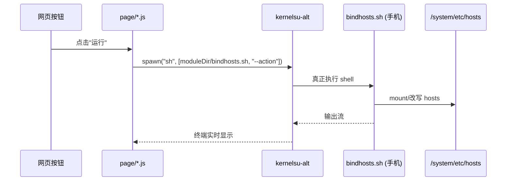

# 04 · WebUI 前端逐页解读

本章拆解 `webui/` 下的管理网页：**入口 → 路由 → 三页（首页/规则/更多）→ 前后端怎么通信**。所有行号取自当前 `master` 分支，末尾有 [一致性说明](#412-与代码的一致性)。

> 技术栈：原生 ES Module JS + [Vite](https://vitejs.dev/) 打包 + [Material Web](https://github.com/material-components/material-web) 组件 + [WebUI X](https://github.com/MMRLApp/WebUI-X) 框架 + [kernelsu-alt](https://github.com/rifsxd/kernelsu-alt) 调 shell。

---

## 4.1 工程配置

- `webui/package.json`：`scripts.build` = `vite build --emptyOutDir`，产物输出到 `module/webroot`（见 `vite.config.js`）。
- 依赖：`kernelsu-alt`（前端↔shell 桥）、`webuix`（WebUI X 事件/Intent）、`@material/web`（UI 组件）、`codemirror`（规则编辑器）。

## 4.2 构建配置

`webui/vite.config.js`：
- `base: './'`：相对路径，方便 WebUI X 直接打开。
- `build.outDir: 'module/webroot'`：打包结果直接进模块目录，安装后手机就读这里。
- `optimizeDeps.exclude: ['webuix']`：WebUI X 全局注入，不打包。

---

## 4.3 入口 index.js（233 行）

文件：`webui/index.js`。页面加载的总指挥。

### 初始化（171–180 行）
```171:180:webui/index.js
document.addEventListener('DOMContentLoaded', async () => {
    initializeLogCatcher();
    await Promise.all([loadTranslations(), exec(`sh ${moduleDirectory}/bindhosts.sh --setup-link`)]);
    document.querySelectorAll('[unresolved]').forEach(el => el.removeAttribute('unresolved'));
    checkMMRL();
    setupSlideMenu();
    router.navigate('home');
    setupUserCustomization();
    setupRickRoll();
});
```
- 第 173 行：页面一打开就 `exec(... --setup-link)`——**前端每次启动都会让后端重新校准 hosts 链接**（对应 [03 §3.2.11] setup_link）。
- 第 177 行：默认导航到首页。

### 底部栏导航（27–30 行）
```27:30:webui/index.js
document.querySelectorAll('.bottom-bar-item').forEach(item => {
    const page = item.getAttribute('page');
    item.addEventListener('click', () => router.navigate(page));
});
```
点底部三个按钮（home/hosts/more）切换页面。

### RickRoll 彩蛋（39–93 行）
- 仅 **4 月 1 日**（`today.getMonth() !== 3` 即非 4 月直接 return）触发，70% 概率。
- 倒计时 5 秒后打开 B站（`tv.danmaku.bili` 已装）或 YouTube 的 Rick Astley 视频（第 85–91 行 `exec` 用 `am start` 拉起浏览器）。
- 用 `localStorage.lastRickRoll` 防止连点重复触发。

### 自定义样式/背景（95–132 行 `setupUserCustomization`）
- 第 100 行：加载 `link/PERSISTENT_DIR/.webui_config/custom.css`（用户放在持久化目录的自定义样式）。
- 第 113 行：依次尝试 `custom_background.webp/jpg/png` 作为背景图。

### 返回键（145–165 行）
- WebUI X 的 `back` 事件：有弹层先关弹层，否则回首页，再否则退出 WebUI。

### 对话框动画（182–232 行）
重写 Material 对话框的开关动画（从底部滑入/滑出），纯视觉。

---

## 4.4 路由 route.js（125 行）

文件：`webui/route.js`，单页应用（SPA）路由。

### 注册表（20–24 行）
```20:24:webui/route.js
this.registry = {
    home:  { html: homeHtml,  module: homeModule },
    hosts: { html: hostsHtml, module: hostsModule },
    more:  { html: moreHtml,  module: moreModule },
};
```
三页的 HTML 和 JS 都预加载进来（`import ... ?raw` 第 5–11 行）。

### 切换逻辑
- `navigate(name)`（31–47 行）：若已在当前页直接返回；否则 `initView` 创建 DOM，`switchTo` 切换。
- `initView`（90–109 行）：把 `section.innerHTML = entry.html`，再调 `module.mount(section)` 绑定事件。
- `switchTo`（52–85 行）：淡入动画 + 更新底部栏 `selected` + 调 `module.onShow()` 生命周期。
- `updateFooter`（111–121 行）：高亮当前页底部按钮。

> 每页导出 `mount()`（首次挂载）、`onShow()`（每次可见）、`onHide()`（每次隐藏）三个生命周期钩子。

---

## 4.5 首页 home（349 行）

文件：`webui/page/home/home.js` + `home.html`。两块：状态卡片 + 域名查询。

### 页面结构（home.html）
- `#status-box`：状态卡片（点 5 下开开发者选项）。
- `#query-box`：搜索框 `#query-input` + 列表 `.host-list-item`。

### updateStatus（14–41 行）— 读模块状态
```14:19:webui/page/home/home.js
const status = [
    { element: 'status-text',  key: 'description', file: 'module.prop' },
    { element: 'version-text', key: 'version',     file: 'module.prop' },
    { element: 'mode-btn',     key: 'mode',        file: 'mode.sh' },
]
```
- 用 `fetchText("link/MODDIR/"+file, ...)` 读手机里的文件（第 23 行）。
- **第 24 行** `.replace('status: ','')`：因为 `service.sh` 会把 `module.prop` 的 `description` 动态改写成 `status: active ✅ | blocked: ...`（见 [03 §3.6]），前端这里把 `status: ` 前缀去掉再显示——这就是兼容性处理。
- `mode-btn` 读 `mode.sh` 的 `mode` 键：实际 `mode.sh` 写的是 `operating_mode=数字`，正则 `mode=(.*)` 能匹配到 `_mode=` 中的 `mode=`，所以正确读到模式号，再经 `getString("mode_button", value)` 翻译成文字。

### setupDevOtp（48–66 行）— 开发者选项开关
连续点 `#status-box` **5 次**（2 秒内）开启开发者选项，用于解锁"模式选择"菜单。

### 模式选择（73–155 行）
- `checkDevOption`（73–81 行）：若持久化目录有 `mode_override.sh` 也自动开开发者选项。
- `updateModeSelection`（87–98 行）：读 `mode_override.sh` 的 `mode=` 勾选当前模式单选。
- `saveModeSelection`（105–120 行）：写 `mode_override.sh`（`echo "mode=N" > ...`，或 reset 时删除），保存后提示重启。
- `setupModeBtn`（123–155 行）：从 `modes.json` 动态生成单选列表（mode 0–10 共 11 种，见 [4.12]），点 `#mode-btn` 弹出菜单（仅开发者选项开启时）。

### getHosts / loadMoreHosts（169–257 行）— 域名查询
- 第 173 行 `fetch('link/hosts.txt')`：读当前生效的 hosts（由后端映射）。
- 第 180–185 行：按行解析，去空行/注释，拆成 `[IP, 域名...]`。
- **分页 30 条**（第 163 行 `batchSize = 30`）：`loadMoreHosts` 每次追加 30 条，滚动到底（`hostList.onscroll`，第 196–210 行）再加载，避免大 hosts 卡顿。
- 第 222 行：IP 为 `0.0.0.0` 的行标为 "block"（可移除），否则 "custom"。

### handleRemove（265–279 行）— 放行域名
点屏蔽条目的删除按钮 → `exec(sh ${moduleDirectory}/bindhosts.sh --whitelist 域名...)`（第 267 行）→ 走后端 `instant_whitelist` 把域名加白名单（见 [03 §3.2.5]）。

### setupQueryInput（285–326 行）— 搜索
搜索框实时过滤（从 `originalHostLines` 全量匹配 IP 或域名），回车/清空都触发。

### 生命周期（329–348 行）
- `mount`（329–334 行）：绑事件（开发者选项/模式/查询/文档菜单）。
- `onShow`（337–342 行）：每次进首页刷新状态、查开发者选项。
- `onHide`（345–347 行）：隐藏模式按钮和 FAB。

---

## 4.6 规则页 hosts（约 850 行）

文件：`webui/page/hosts/hosts.js` + `hosts.html`。核心：**编辑 5 类规则文件 + 运行模块**。

### 五类文件（util.js 8–15 行 `filePaths`）
| key | 文件 | 作用 |
|-----|------|------|
| `custom` | `custom.txt` | 用户自定义 hosts 规则 |
| `sources` | `sources.txt` | 订阅源列表（见 [03 §3.12]） |
| `blacklist` | `blacklist.txt` | 强制屏蔽（不被白名单覆盖） |
| `whitelist` | `whitelist.txt` | 白名单（从屏蔽结果剔除） |
| `sources_whitelist` | `sources_whitelist.txt` | 订阅源级白名单 |

### 文件浏览与编辑
- `loadFile`（约 60–130 行）：用 `fetchText` 读文件内容到 [CodeMirror](https://codemirror.net/) 编辑器。
- `saveFile`（约 200–235 行）：`echo` 写回，第 233 行 `exec('echo "${line}" >> ...')` 追加行，由 `addDomain` 调用。
- **增删规则不是调 `--whitelist`/`--blacklist` 参数**，而是**直接 `sed`/`echo`/`rm` 改文件**（第 132/153/233 行），改完点"运行"才生效。

### CodeMirror 编辑器
规则编辑框用 CodeMirror（约 300–380 行的 `initEditor` / 相关调用），支持行号、语法高亮。

### 导入自定义文件（约 490–546 行 `importCustomHost`）
- 第 546 行校验文件 < 128KB（`wc -c < ... -lt 131072`），过大则拒绝。
- 把用户选的文件内容写进 `custom*.txt`（第 479 行 `exec(ls ... | grep "custom.*.txt")` 找现有自定义文件）。

### 运行模块（423–436 行 `runBindhosts`）
```423:436:webui/page/hosts/hosts.js
function runBindhosts(args) {
    // ...
    const output = spawn("sh", [`${moduleDirectory}/bindhosts.sh`, `${args}`]);
}
```
- 第 805 行："运行"按钮 → `runBindhosts("--action")`（应用规则到系统）。
- 第 806 行："强制更新"按钮 → `runBindhosts("--force-update")`（重新拉订阅源）。
- 用 `spawn`（不是 `exec`）拿到实时输出流，显示在终端框里（伪终端体验）。

### 各终端/弹层
- `#action-terminal`：运行输出。
- `#edit-content`：编辑文件终端。
- 这些 UI 显隐由 `util.js` 的 `PAGE_CONFIG` + `updateUIVisibility` 控制（见 [4.8]）。

---

## 4.7 更多页 more（约 250 行）

文件：`webui/page/more/more.js` + `more.html`。

### 页面结构（more.html 实际 DOM id）
- 控制面板：`#language-container`（语言）、`#tcpdump-container`（抓包）、`#tiles-container`（快捷开关）、`#action-redirect-container`（action 重定向开关 `#action-redirect`）、`#cron-toggle-container`（每日更新开关 `#toggle-cron`）、`#update-toggle-container`（模块更新开关 `#toggle-version`）。
- 文档：`about-docs[data-type=source|usage|modes|hiding|faq]`。
- 支持：`#github-issues`、`#canary-update`、`#locales-update`、`#view-webui-log`。
- 备份恢复：`#export`、`#restore`。

### more.js 关键函数（行号以实际代码为准）
- `findIssue`（约 24–33 行）：读 `module.prop` 的 `updateJson` 拼出 GitHub issues 链接。
- `issueTracker`（39–41 行）：点击 `#github-issues` → 浏览器打开 issue 页（指向 `shiqianwei0508/bindhosts`）。
- `canaryUpdate`（约 198–201 行）：点击 `#canary-update` → `runBindhosts("--install-canary")` 自更新。
- `localesUpdate`（约 226–228 行）：点击 `#locales-update` → `runBindhosts("--update-locales")`。
  - ✅ locales 源链接已指向用户仓库 `shiqianwei0508/bindhosts`（master 分支），符合铁律4。
- `reboot`：重启设备，调用 `util.js` 的 `reboot()`（util.js 第 103–106 行，内部 `svc power reboot`；more.js 自身第 251 行只是 `isDownloading=false`，非 reboot 实现）。

### 生命周期
- `mount`：绑定上述所有按钮事件、设置语言列表、开关初始状态。
- `onShow`：刷新开关状态、加载日志。

---

## 4.8 前端工具 util.js（434 行）

文件：`webui/utils/util.js`，全局复用函数。

| 函数 | 行号 | 作用 |
|------|------|------|
| `fetchText(url, fallback)` | 26–41 | 先 `fetch`，失败用 `exec cat` 兜底读手机文件 |
| `linkRedirect(link)` | 47–66 | 用 WebUI X Intent 或 `am start` 打开外部链接 |
| `showPrompt(msg, success, dur, btn, cb)` | 77–97 | 底部提示条（带可选按钮） |
| `reboot()` | 103–106 | 2 秒后重启 |
| `checkMMRL()` | 112–121 | 在 MMRL 里设置状态栏深浅色 |
| `setupSwipeToClose(el)` | 128–219 | 侧滑关闭抽屉菜单 |
| `setupSlideMenu()` | 225–251 | 初始化所有 `.slide-menu` |
| `updateUIVisibility(terminalId, isOpen)` | 304–369 | 根据当前终端显隐对应按钮/标题 |
| `setupScrollEvent(content)` | 372–433 | 滚动时隐藏 FAB、滚动到底加载更多 |

**常量（8–18 行）**：
- `filePaths`：5 类规则文件路径（见 [4.6]）。
- `basePath = "/data/adb/bindhosts"`：持久化目录。
- `moduleDirectory = "/data/adb/modules/bindhosts"`：模块目录（后端脚本位置）。

**PAGE_CONFIG（261–297 行）**：每页的 FAB 容器、主按钮、终端按钮配置，供 `updateUIVisibility`/`setupScrollEvent` 用。

---

## 4.9 国际化（language.js）

`webui/utils/language.js`：`loadTranslations()` / `applyTranslations()` / `getString(key, ...)`。HTML 里 `data-i18n="xxx"` 属性在页面显示时被替换成对应语言文本；语言包在 `WEBROOT/locales/`（由 `update_locales` 拉取）。

## 4.10 历史栈（history.js）

`webui/utils/history.js`：`registerManagedDialog` / `closeTopManagedLayer` / `hasManagedHistoryLayer`。把对话框/抽屉压入"返回栈"，按返回键时先关最上层，而不是直接退出页面。

## 4.11 日志捕获（log_catcher.js）

`webui/utils/log_catcher.js`：`initializeLogCatcher()`，捕获页面 `console` 日志，供"查看 WebUI 日志"功能（`#view-webui-log`）回看。

## 4.12 模式数据（modes.json）

`webui/page/home/modes.json`：11 个模式项（value 0–10），描述对应 [03 §3.5] 的 `operating_mode`：

| value | description |
|-------|-------------|
| 0 | Default |
| 1 | ksu_susfs_bind |
| 2 | plain bindhosts |
| 3 | apatch_hfr, hosts_file_redirect |
| 4 | zn_hostsredirect |
| 5 | ksu_susfs_open_redirect |
| 6 | ksu_source_mod |
| 7 | generic_overlay |
| 8 | ksu_susfs_overlay |
| 9 | ksu_susfs_bind_kstat |
| 10 | ksud_kernel_umount |

---

## 4.13 前后端通信机制（核心）



- 前端**不是**和某个 HTTP 后端通信，而是通过 [kernelsu-alt](https://github.com/rifsxd/kernelsu-alt) 的 `exec` / `spawn` **直接在手机上运行 shell 命令**（`sh /data/adb/modules/bindhosts/bindhosts.sh --参数`）。
- `exec`：执行并等结果返回（用于读文件、查状态、加白名单）。
- `spawn`：启动子进程、拿实时输出流（用于"运行模块"看进度）。
- `moduleDirectory`（`/data/adb/modules/bindhosts`）是后端脚本路径（util.js 第 18 行）。
- 读手机文件用 `fetchText`，它先 `fetch("link/...")`（WebUI X 把 `link/` 映射到模块目录），失败再 `exec cat` 兜底。

---

## 4.14 与代码的一致性

所有行号、函数名、DOM id、参数均取自当前 `master` 分支源码并经 code-explorer 子代理逐文件复核（覆盖 index.js / route.js / home.js / hosts.js / more.js / util.js）。复核后已修正：

- **more.js `reboot` 行号**：`svc power reboot` 实际在 `util.js` 第 103–106 行的 `reboot()` 内；more.js 自身第 251 行只是 `isDownloading=false`，非 reboot 实现，已更正归属。

确认一致的关键点：
1. index.js 第 173 行启动即 `--setup-link`、RickRoll 仅 4/1、底部栏导航(27–30) 均与源码一致。
2. route.js 三页注册(20–24)、hosts.js `spawn` 运行(423–436) 与 `--action`/`--force-update`(805/806)、home.js `replace('status: ','')`(24)/连点5下(48–66)/分页30(163) 均一致。
3. util.js 常量与函数行号全部准确。

已正确标注的差异（非文档错误）：
- `more.js` 的 `localesUpdate`(228) 与 `github-issues`(570) 外链原先指向**原版** `bindhosts/bindhosts`，已于 2026-08-18 修正为 `shiqianwei0508/bindhosts`（master 分支），符合铁律4。
- 规则页增删域名是**直接 `sed`/`echo`/`rm` 改文件**，而非调用 `--blacklist`/`--whitelist` 参数；只有首页"放行"和 `--action`/`--force-update` 调 bindhosts.sh 参数。

> 下一章 [05-build-and-release.md](./05-build-and-release.md) 讲本地打包与发布。
