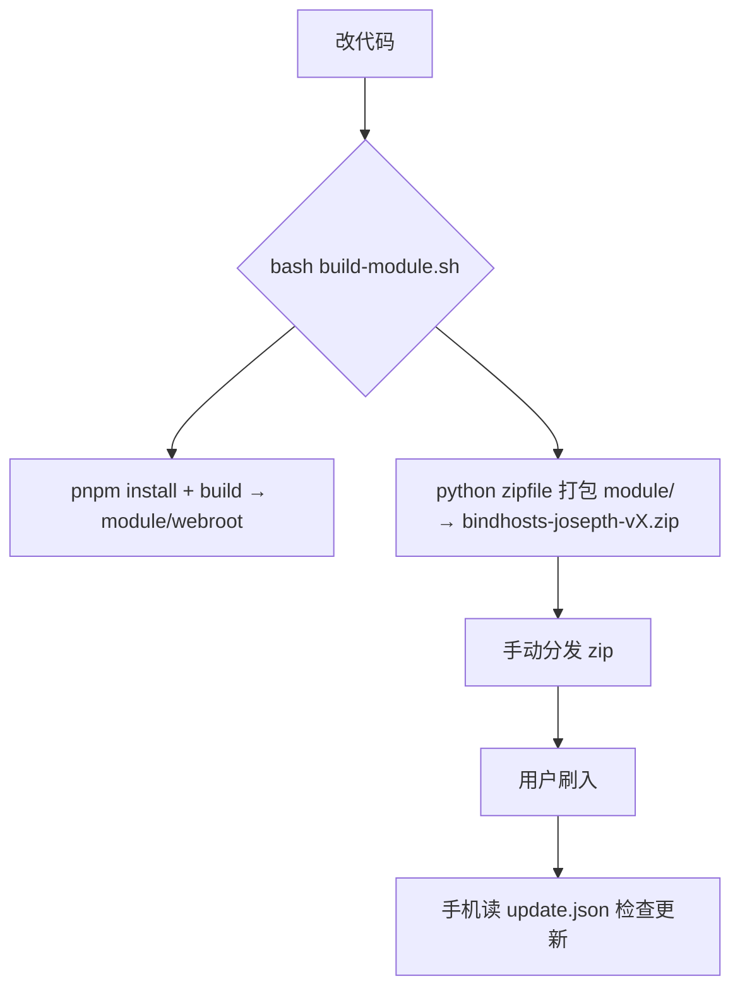

# 05 · 构建与发布

本章讲"怎么把代码变成一个能刷进手机的 zip"。包含：本地打包脚本、版本信息文件、版本号同步铁律、以及本 fork 因无 release 权限而采用的发布方式。

---

## 5.1 整体流程



> 原版用 GitHub Action（`.github/workflows/release.yml`）自动发版；**本 fork 的 GitHub 账号无 release 权限**，所以改为本地 `build-module.sh` 产出 zip，再手动分发（铁律相关，见 §5.5）。

---

## 5.2 build-module.sh — 本地打包脚本（75 行）

文件：根目录 `build-module.sh`。复刻 release.yml 的"构建 webroot + 打包 module"。

### 配置（20–22 行）
```20:22:build-module.sh
MODULE_NAME='bindhosts'
ZIP_PREFIX="${ZIP_PREFIX:-bindhosts-josepth}"
```
- `ZIP_PREFIX` 可环境变量覆盖，默认 `bindhosts-josepth`（铁律2：包名带 `-josepth` 区分分发）。

### 取版本号（24–38 行）
- 优先用 `jq` 读 `update.json` 的 `version`（第 29 行）；无 `jq` 时用 `grep`+`sed` 兜底（第 27 行）。
- 拼出 `ZIP_NAME="bindhosts-josepth-v2.1.4.zip"`（第 37 行）。

### 步骤1：构建前端（40–50 行）
```42:49:build-module.sh
cd webui
if command -v pnpm >/dev/null 2>&1; then
  pnpm install --frozen-lockfile
  pnpm build
```
- `pnpm install --frozen-lockfile`：按锁定文件装依赖（要求仓库有 `pnpm-lock.yaml`）。
- `pnpm build`：Vite 打包到 `module/webroot`（见 [04 §4.2]）。

### 步骤2：打包（52–74 行）
- 用 **Python `zipfile`**（第 57–70 行）把整个 `module/` 目录打包，跳过 `.git`。
- 选择 Python 而非 `zip` 命令：因为 **Windows Git Bash 不自带 `zip`**，Python 跨平台兜底。
- 第 73–74 行打印产出路径与大小。

### 运行方式
Windows 需用 **Git Bash**（`C:\Program Files\Git\bin\bash.exe`）：
```powershell
& "C:\Program Files\Git\bin\bash.exe" build-module.sh
```
> 该脚本已 `git add` 入库（见 `.gitignore` 仅忽略 `bindhosts-josepth-*.zip` 产物）。

---

## 5.3 update.json — 版本与更新信息（6 行）

文件：根目录 `update.json`：
```1:6:update.json
{
  "version": "v2.1.4",
  "versionCode": 214,
  "zipUrl": "https://github.com/shiqianwei0508/bindhosts/releases/latest/download/bindhosts-josepth-v2.1.4.zip",
  "changelog": "https://raw.githubusercontent.com/shiqianwei0508/bindhosts/master/CHANGELOG.md"
}
```

| 字段 | 作用 |
|------|------|
| `version` | 版本字符串（包名用） |
| `versionCode` | 整数版本码，OTA 比较用 |
| `zipUrl` | 新版本 zip 下载地址（管理器读它升级） |
| `changelog` | 更新日志地址 |

> ⚠️ **当前 `zipUrl` 指向 `releases/latest/download/...`**，依赖 GitHub release 存在。但本 fork 无 release 权限，所以该地址实际 404。若要真正可用，需把 `zipUrl` 改成不依赖 release 的托管（GitHub Pages / Gitee / 自有服务器），见 §5.5。

---

## 5.4 版本号同步铁律（发版必做）

**铁律3**：改版本时必须同步 4 处，否则自动发版流程（或 OTA 判断）不触发：

| # | 文件 | 改什么 |
|---|------|--------|
| 1 | `module/module.prop` | `version=v2.1.5` + `versionCode=215`（+1） |
| 2 | `update.json` | `version`、`versionCode`、`zipUrl` 文件名里的版本号 |
| 3 | `CHANGELOG.md` | 加本次更新条目 |
| 4 | （可选）`build-module.sh` 不用改，它自动读 `update.json` | — |

示例（从 v2.1.4 → v2.1.5）：
```
module.prop:          version=v2.1.5   versionCode=215
update.json:          version=v2.1.5   versionCode=215
                      zipUrl=.../bindhosts-josepth-v2.1.5.zip
CHANGELOG.md:         ## v2.1.5 (date)  + 改动说明
```

---

## 5.5 本 fork 的发布方式（无 GitHub release 权限）

原版 release.yml 在有 release 权限时会：
1. 检测 `versionCode` 是否比上次大（铁律3 的判据）；
2. 大则 `pnpm build` + `zip` + 用 `softprops/action-gh-release` 建 release。

本 fork 因 GitHub 账号无 release 权限，改用：
1. 本地跑 `bash build-module.sh` → 产出 `bindhosts-josepth-vX.zip`；
2. **手动**把 zip 传到可访问地址（若 Web 手动传 release 页可行，则直接传；否则改 `update.json` 的 `zipUrl` 到其他托管）；
3. 同步铁律3 的版本号与 `CHANGELOG.md`；
4. push 代码（CI 仍会跑，但只上传 artifact、不建 release——符合预期）。

> 模块 id 永远 `bindhosts`（铁律1），仅 zip 名带 `-josepth`（铁律2），这是为了覆盖原版安装。

---

## 5.6 与代码的一致性

- `build-module.sh` 行号、逻辑与文件实际内容一致（75 行，Python zipfile 兜底）。
- `update.json` 实际 `versionCode=214`（非先前误记的其他值），`zipUrl` 确实指向 `releases/latest/download/`（依赖 release，本 fork 不可用，已标注）。

> 下一章 [06-usage.md](./06-usage.md) 讲普通用户怎么用。
